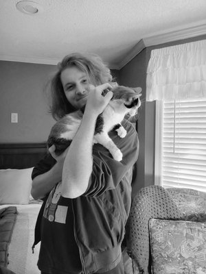
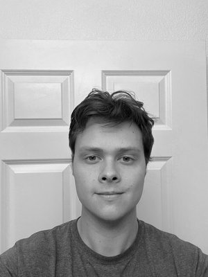
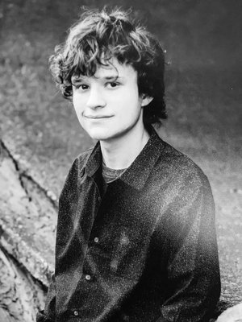
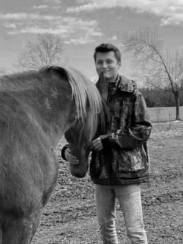

# theblackbox.github.io
This is an early version of our GitHub version of our website for The Blackbox as we work on migrating it from Squarespace.

We're designing a guitar pedal.

THE BLACKBOX

An entirely hands-free guitar FX pedal that provides the user with the ability to switch from a variety of different FX presets with a single input mid-performance.

When a guitarist is playing on-stage, the last thing they want to do is bend down and turn knobs every time they need to adjust their FX. The Blackbox allows the user to switch seamlessly between parameters mid-performance, using only their feet. While other products may have similar capabilities, they do not allow the user to be completely hands-free. this product allows the user to switch between three distinct FX of their choosing and offers a pedal for volume control, along with an LCD screen to display which FX the user is currently editing.

DOCUMENTATION
* [Executive Summary](https://github.com/GeorgeMicah24/theblackbox.github.io/blob/main/TheBlackbox_ExecutiveSummary_Final.pdf)
* [Problem Statement](https://github.com/GeorgeMicah24/theblackbox.github.io/blob/main/AlternativeInstrumentation_ProblemStatement_Final.pdf)
* [Engineering Requirements](https://github.com/GeorgeMicah24/theblackbox.github.io/blob/main/TheBlackbox_DesignRequirementSpecifications_Final-6.pdf)
* [Design Approach](https://github.com/GeorgeMicah24/theblackbox.github.io/blob/main/TheBlackbox_ApproachDocument_Final-1-1.pdf)

MEET THE TEAM - 
♫ Alternative Instrumentation ♫

CASH HENDERSON
* Team Lead & Digital FX Design Sub-Team Co-Lead

IAN AVANT
* Digital FX Design Sub-Team Co-Lead

MAX HAYHURST
* User Interface & Enclosure Sub-Team Lead

MICAH GEORGE
* Micro Control Logic Sub-Team Lead

CLAYTON JOBE
* Micro Control Logic & U.I. Sub-Teams Support

And our faculty advisor,
DR. JOHN BALL!

He researches digital signal processing and helps give us ideas on how this type of project is shaped.
